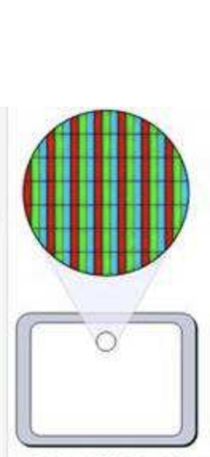
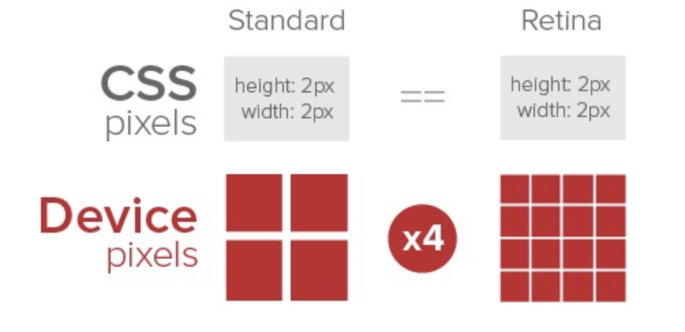

# 基础原理

# rem & dpr

* **物理像素**: 显示器最小显示单元

* **设备独立像素**：如css中的px单元，计算机坐标中的一个点，这个点计算后转换成物理像素的点

* **设备像素比(DPR-device pixel ratio)** = 物理像素 / 设备像素



```javascript
var dpr = window.devicePixelRatio
```

* **视口(viewport)**: 浏览器内容区域，不包含工具条，滚动条

```html
<!-- html里的视口定义  -->
<metaname="viewport"content=“width=device-width,minimum-scale=1.0,maximum-scale=1.0”/>
```

```javascript
// 获取视口
var viewPortWidth = document.documentElement.clientWidth
```
