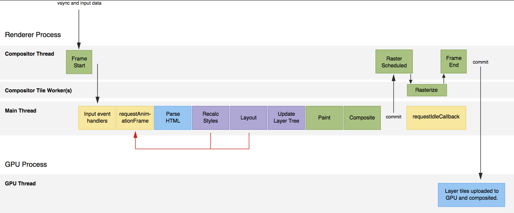

# 基础原理

* [浏览器内核](#browser-core)
* [像素单位](#pixel)
* [手势触摸](#touch)
* [localStorage & sessionStorage](#local-storage)
* 网络与协议
  * [XHR](#xhr)
  * [Service Worker](#service-worker)
  * [Server Sent Event](#server-sent-event)
  * [WebSocket](#websocket)
  * [WebRTC](#web-rtc)
  * [web Workers](#web-workers)

## 浏览器内核

### 从请求到渲染浏览器发生了什么

```
[navigationStart]
| 页面 unload 事件触发
| 浏览器内核加载新页面
[fetchStart]：表示开始获取当前页面的内容
| 查询缓存（如果有，直接从缓存获取）
[dmainLookupStart]
| DNS 解析
[domainLookupEnd]
[connectStart]
| TCP 连接
[connectEnd]
[requestStart]
| 请求内容至服务器
| 浏览器接收完整的响应结果
[requestEnd] 
| --- 同时 ---
[domLoading]
| 开始 DOM 树解析
[domInteractive]
[domContentLoadedStart]
| 运行脚本，加载依赖外部资源
[domContentLoadedEnd]
[domComplete]
| 触发 window.onload 
[loadEventStart]
| 执行 load 回调
[loadEventEnd]
```

### 浏览器渲染

[参考](https://chuckliu.me/#!/posts/58ea6af15dc1822fa9a57274)



<a name="pixel" id="pixel"></a>

## 像素单位

* **像素**


* **物理像素**

显示器最小显示单元


* **设备独立像素**

如css中的px单元，计算机坐标中的一个点，这个点计算后转换成物理像素的点

* **设备像素比(DPR-device pixel ratio)** = 物理像素 / 设备像素


```javascript
var dpr = window.devicePixelRatio
```
<a name="view-unit" />

* **视口(viewport)**

默认是 980px， 代表手机可以看到的部分，如果小于默认的 980px，会缩小渲染

可以使用Meta 标签来修改视口属性

* width
* initial-scale
* minimum-scale
* maximum-scale
* height
* user-scalable

* **视口单位（ Viewport units )**
vw, vh, vmin, vmax

## 尺寸

* **屏幕尺寸**
  >意义：用户屏幕的整体大小。
   度量单位：设备像素。
```javascript
screen.width
screen.height
```


* **窗口尺寸**
  > 意义：浏览器窗口的整体大小，**包括滚动条**。
  度量单位：CSS像素。
```javascript
window.innerWidth
window.innerHeight
```


* **滚动距离**
  > 意义：页面滚动的距离。
   度量单位：CSS像素。
```javascript
window.pageXOffset
window.pageYOffset
```


* **视口(viewport)**

浏览器内容区域 **不包含工具条，滚动条**

```html
<!-- 例子  -->
<metaname="viewport"content=“width=device-width,minimum-scale=1.0,maximum-scale=1.0”/>
```

```javascript
document.documentElement.clientWidth
document.documentElement.clientHeight
```


>1.**view port 与html 大小无关**
>2. **document.documentElement.clientWidth和-Height并不包含滚动条，但是window.innerWidth/Height包含**

* **页面尺寸**
  >意义：<html>元素（也就是页面）的尺寸。
  度量单位：CSS像素。


* **事件中的坐标**
  * pageX/Y
    >
    
  * clientX/Y
    >
    
  * screenX/Y
    >  

<a name="touch" id="touch"></a>

## 触摸（touch）


### 触摸事件

  * touchstart
  * touchmove
  * touchend
  * touchcancel

### 触摸跟踪属性
  * touches: 当前跟踪的触摸操作的Touch对象的数组
  * targetTouchs: 特定于事件目标的Touch对象的数组
  * changeTouches: 表示自上次触摸以来发生了什么改变的Touch对象数组

### Touch对象属性

```js
{
  clientX
  clientY
  identifier // 标识触摸的唯一 ID
  pageX
  pageY
  screenX
  screenY
  target     // 触摸的DOM 节点目标
}
```

### 触摸事件顺序

 1. touchstart
 2. mouseover
 3. mousemove (一次)
 4. mousedown
 5. mouseup
 6. click
 7. touchend

### 手势事件
> 当两个手指触摸屏幕时就会产生手势
  * gesturestart: 当一个手指已经按在屏幕上而另一个手指又触摸时触发
  * gesturechange: 当触摸屏幕的任何一个手指的位置发生变化时触发
  * gestureend: 当任何一个手指从屏幕上面移开时触发

#### 额外属性
  * rotation
  * scale

## 参考链接
  * http://weizhifeng.net/viewports.html
  * 《javascript 高级程序设计（第三版）》

## XHR
<a name="xhr" />

```js
var xhr = new XMLHttpRequest();

xhr.open('GET', 'example.php');
xhr.send();

/**
　　* xhr.readyState：XMLHttpRequest对象的状态，等于4表示数据已经接收完毕。

　　* xhr.status：服务器返回的状态码，等于200表示一切正常。

　　* xhr.responseText：服务器返回的文本数据

　　* xhr.responseXML：服务器返回的XML格式的数据

　　* xhr.statusText：服务器返回的状态文本。
*/
xhr.onreadystatechange = function(){
  if ( xhr.readyState == 4 && xhr.status == 200 ) {
    alert( xhr.responseText );
  } else {
    alert( xhr.statusText );
  }
};
```

#### XHR2

[参考链接](http://www.ruanyifeng.com/blog/2012/09/xmlhttprequest_level_2.html)

* 可以设置HTTP请求的时限。
```js
　xhr.timeout = 3000;

　xhr.ontimeout = function(event){
　　alert('请求超时！');
  }
```

* 可以使用FormData对象管理表单数据。


* 可以请求不同域名下的数据（跨域请求）。

* 可以上传文件。
```js
　var formData = new FormData();
  for (var i = 0; i < files.length;i++) {
    formData.append('files[]', files[i]);
  }
  xhr.send(formData);
```
* 可以获取服务器端的二进制数据。

```js
void send();
void send(ArrayBuffer data);
void send(Blob data);
void send(Document data);
void send(DOMString? data);
void send(FormData data);
```

* 可以获得数据传输的进度信息。

```js
  xhr.onprogress = updateProgress;
  xhr.upload.onprogress = updateProgress;
  /**
  　* load事件：传输成功完成。

　　* abort事件：传输被用户取消。

　　* error事件：传输中出现错误。

　　* loadstart事件：传输开始。

　　* loadEnd事件：传输结束，但是不知道成功还是失败。
  */
```


<a name="service-worker" />

## Service Worker

<a name="local-storage"  id="local-storage"/>

## localStorage

```js
// 存储数据
localStorage.setItem('key', '数据1')
// 获取数据
var value = localStorage.getItem('key')
// 删除数据
localStorage.removeItem('key')
```

## indexDB

<a name="server-sent-event" />

## server sent event

可在请求后服务器主动推送消息

```js
if(!!window.EventSource) {
  connect()
}

/**
服务器返回头部
(
  200, {
    "Content-Type":"text/event-stream",
    "Cache-Control":"no-cache",
    "Connection":"keep-alive"
  }
)
*/
function connect() {
  var source = new EventSource([请求的服务器地址])

  source.addEventListener("message", function(event){
    // event.data
    // 收到服务器消息后...
  })

  source.addEventListener("open", function(event) {
    // 打开连接成功
  })

  source.addEventListener("error", function(event) {
    // 打开连接失败
  })
}
```

<a name="websocket" />

## WebSocket

> 基于 TCP 连接进行全双工通信

```js
var Socket = new WebSocket(url, [protocol])
```

## webRTC

web实时通信，为浏览器和移动网页应用提供实时的语音或者视频通话功能

[adapter.js](https://www.npmjs.com/package/webrtc-adapter)
[浏览器接口差异](https://webrtc.org/web-apis/interop/)

<a name="web-workers"/>

## web Workers

创建一个新的线程

```js
// 前台
var w = new Worker([后台js文件路径])
w.postMessage([发送的数据])
w.onmessage = function(event) {
  var res = event.data
}

// 后台js
this.onmessage = function(event) {
  var res = handle(event.data)
  this.postMessage(res)
}
```