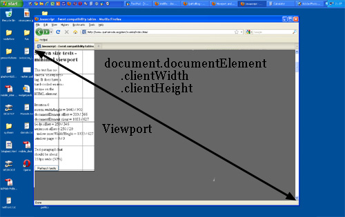

# 基础原理

## 像素单位

* **像素**


* **物理像素**

显示器最小显示单元


* **设备独立像素**

如css中的px单元，计算机坐标中的一个点，这个点计算后转换成物理像素的点

* **设备像素比(DPR-device pixel ratio)** = 物理像素 / 设备像素


```javascript
var dpr = window.devicePixelRatio
```
<a href="#view-unit" />

* **视口单位（ Viewport units )**
vw, vh, vmin, vmax

## 尺寸

* **屏幕尺寸**
  >意义：用户屏幕的整体大小。
   度量单位：设备像素。
```javascript
screen.width
screen.height
```


* **窗口尺寸**
  > 意义：浏览器窗口的整体大小，**包括滚动条**。
  度量单位：CSS像素。
```javascript
window.innerWidth
window.innerHeight
```


* **滚动距离**
  > 意义：页面滚动的距离。
   度量单位：CSS像素。
```javascript
window.pageXOffset
window.pageYOffset
```


* **视口(viewport)**

浏览器内容区域 **不包含工具条，滚动条**

```html
<!-- 例子  -->
<metaname="viewport"content=“width=device-width,minimum-scale=1.0,maximum-scale=1.0”/>
```

```javascript
document.documentElement.clientWidth
document.documentElement.clientHeight
```


>1.**view port 与html 大小无关**
>2. **document.documentElement.clientWidth和-Height并不包含滚动条，但是window.innerWidth/Height包含**

* **页面尺寸**
  >意义：<html>元素（也就是页面）的尺寸。
  度量单位：CSS像素。


* **事件中的坐标**
  * pageX/Y
    >
    
  * clientX/Y
    >
    
  * screenX/Y
    >  

<a name="touch" id="touch"></a>

## 触摸（touch）


### 触摸事件

  * touchstart
  * touchmove
  * touchend
  * touchcancel

### 触摸跟踪属性
  * touches: 当前跟踪的触摸操作的Touch对象的数组
  * targetTouchs: 特定于事件目标的Touch对象的数组
  * changeTouches: 表示自上次触摸以来发生了什么改变的Touch对象数组

### Touch对象属性

```js
{
  clientX
  clientY
  identifier // 标识触摸的唯一 ID
  pageX
  pageY
  screenX
  screenY
  target     // 触摸的DOM 节点目标
}
```

### 触摸事件顺序

 1. touchstart
 2. mouseover
 3. mousemove (一次)
 4. mousedown
 5. mouseup
 6. click
 7. touchend


## 参考链接
  * http://weizhifeng.net/viewports.html
