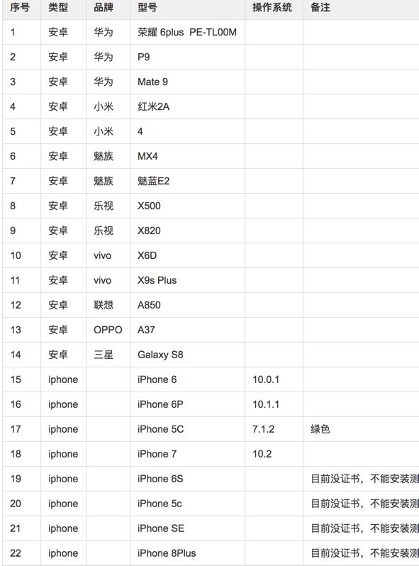

# 兼容性
___

## 主流测试浏览器（中国）



## 常见问题解决方案

### 清除输入框内阴影
iOS上的几乎任何浏览器输入框（input, textarea）默认有内部阴影，但无法使用 box-shadow 来清除，如果不需要阴影，可以这样关闭：

```css
input,
textarea {
	/* 方法1: 去掉边框 */
	border: 0;

	/* 方法2: 边框色透明 */
	border-color: transparent;

	/* 方法3: 重置输入框默认外观 */
	-webkit-appearance: none;
	appearance: none;
}
```

# 参考链接

* https://github.com/doyoe/trip