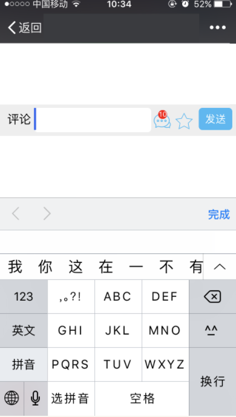

# 兼容性与奇怪问题
___

## 2018年1月截止主流测试

### 主要测试系统版本

> IOS 8+ 
 Android 4.4+

### 常见机型




## 常见问题解决方案

### e.preventDefault 报异常 

Chrome 更新 addEventListener 第三个参数，以前只有 true|false, 现在还可以传对象, 如果项目中报错（如滚动，touch 拖动时候），很有可能跟第三个参数 {passive} 有关

[详细](https://zhuanlan.zhihu.com/p/24385322)


### 移动端 body, overflow: hidden 禁止滚动失效

css方案: 
```css
/* 方案1，有坑*/
body{
	overflow: hidden;
	position: fixed;
}

/* 方案2 */
body{
	overflow: hidden;
	position: relative;
}

/* 官方方案3 */
/*
> But you can work around it by making the body element itself, not the viewport, hide its overflow.
> There is one final gotcha to watch out for: the body itself must not be larger than the viewport. */
html,
body {
    height: 100%;
    overflow: hidden;
}
/* elements which are positioned absolutely. */
/* Their ultimate offset parent is the viewport */
/* prevents those elements from breaking out of the body box. */
body {
    position: relative;
}
```

js方案:
> 当禁止滚动时阻止touchmove事件，开启时，再把 preventDefault 移除
```js
$(document).on('touchmove',function (e){
    e.preventDefault();
});
```

参考:
 * [知乎回答](https://www.zhihu.com/question/35453154)
 * [豆瓣：body overflow:hidden 在移动端失效了?](https://www.douban.com/note/561975262/)

### IOS7以下 position: fixed 问题

IOS7以下，如果**input**使用 ***position:fixed;*** ,在输入框聚焦时会弹出IOS原生输入框，这时输入框固定在了页面中间。



一般解决方法是替换成 **position: absolute;** css里添加 **-webkit-overflow-scrolling: touch;** 来解决滚动时不流畅的问题

```html
<div class="main_comment">```````````````````</div>
<div class="commentBar">回复框</div>
```

```css
.main_comment{
  width: 100%;
  position: absolute;
  overflow-y: auto;
  top: 0;
  bottom: 0;
  -webkit-overflow-scrolling: touch;   /*这句是为了滑动更顺畅*/
}
.commentBar{
  width: 100%;
  position: absolute;
  bottom: 0;
  left: 0;
  background: #fff;
  padding: 5px;
  z-index: 99;
}
```

其他参考:
* [关于IOS 7.0中网页position=fixed的问题](http://blog.sina.com.cn/s/blog_79c02b6b0101kkg2.html)

* [微信下 position:fixed；背景颜色问题](https://segmentfault.com/a/1190000010510291)

### 移动端:active伪类无效的解决方法

>[1] By default, Safari Mobile does not use the :active state unless there is a touchstart event handler on the relevant element or on the <body>.

移动端, **需要在html,body 上添加touchstart事件**才能开启 :active伪类

```javascript
 document.body.addEventListener('touchstart', function () {});
```

### 清除输入框内阴影
iOS上的几乎任何浏览器输入框（input, textarea）默认有内部阴影，但无法使用 box-shadow 来清除，如果不需要阴影，可以这样关闭：

```css
input,
textarea {
	/* 方法1: 去掉边框 */
	border: 0;

	/* 方法2: 边框色透明 */
	border-color: transparent;

	/* 方法3: 重置输入框默认外观 */
	-webkit-appearance: none;
	appearance: none;
}
```

<a href="retina-border-1px">

### retina 屏幕 border:1px 问题

[问题说明](http://mobile.51cto.com/web-484304.htm)

主要是分辨率高的屏幕下 1px的线会变得粗一点

[解决方案](https://www.jianshu.com/p/7e63f5a32636)


推荐: 
* viewport + rem 实现(淘宝方案)
* 伪类 + transform 实现

```css
.scale-1px{
  position: relative;
  border:none;
}
.scale-1px:after{
  content: '';
  position: absolute;
  bottom: 0;
  background: #000;
  width: 100%;
  height: 1px;
  -webkit-transform: scaleY(0.5);
  transform: scaleY(0.5);
  -webkit-transform-origin: 0 0;
  transform-origin: 0 0;
}
```

```javascript
if(window.devicePixelRatio && devicePixelRatio >= 2){
  document.querySelector('ul').className = 'scale-1px';
}
```