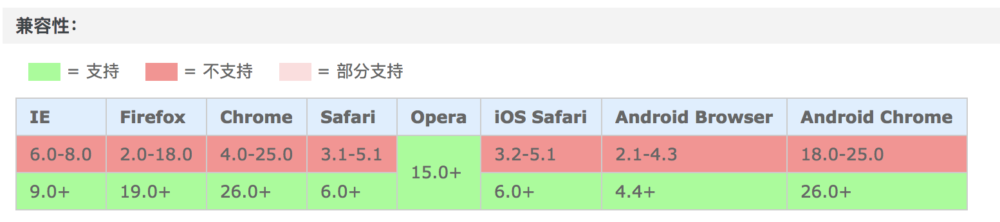
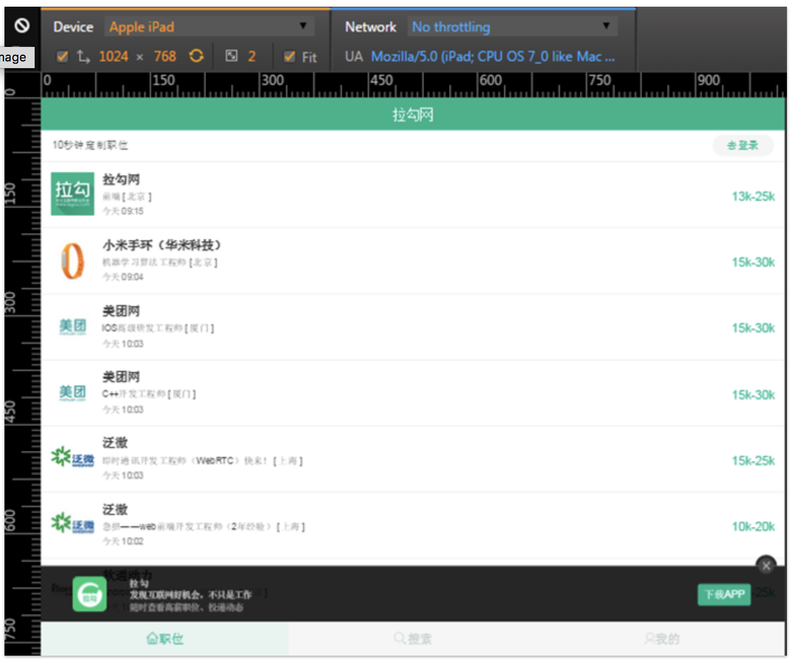
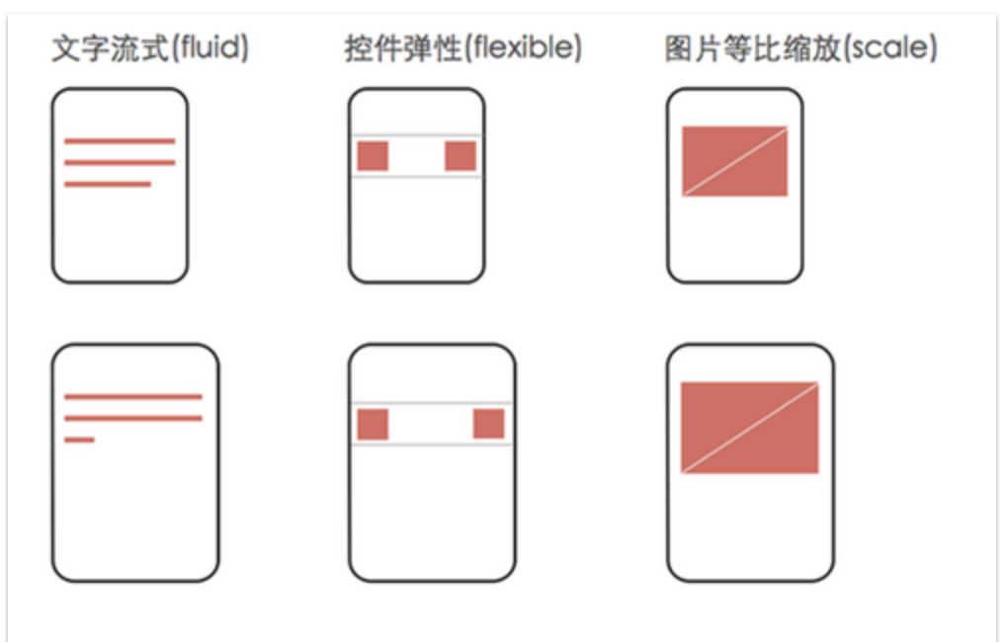

# 布局

## 常见手机屏幕宽度
手机屏幕范围一般取 320px ~ 750px, 大于这个范围一般默认为PC

* iphone4 : 320px
* iphone6 : 375px

> UI 设计图宽度一般为 640px,750px

## rem 布局

[参考连接](https://segmentfault.com/a/1190000007526917)

### 方法1： 1rem=100px 布局
先在 header 里定义 meta-view 让页面不可缩放

```html
<meta name="viewport" content="width=device-width, initial-scale=1, maximum-scale=1, minimum-scale=1, user-scalable=no, shrink-to-fit=no">
```
然后在js代码里面写入下面代码

> 这个代码会根据手机屏幕宽度计算全局font-size，这个size能让我们用 1rem = 100px 的比例写css里的大小

> 之所以用100倍的大小，一是计算方便，二是因为html设置为1px，那么通过计算会得0.xx 这样的数，有些手机会当作0px

> ***750是UI设计图的宽度，这里如果不一样需要替换***

```javascript
(function (doc, win) {
  var docEl = doc.documentElement,
      resizeEvt = 'orientationchange' in window ? 'orientationchange' : 'resize',
      recalc = function () {
          var clientWidth = docEl.clientWidth;
          if (!clientWidth) return;
          if(clientWidth>=750){
              docEl.style.fontSize = '100px';
          }else{
              docEl.style.fontSize = 100 * (clientWidth / 750) + 'px';
          }
      };
  if (!doc.addEventListener) return;
  win.addEventListener(resizeEvt, recalc, false);
  doc.addEventListener('DOMContentLoaded', recalc, false);
})(document, window);  
```
这样就可以在 css 里方便的计算 rem 了

```css
input {
  width: 100%;
  height: 1.3rem; /* 1rem = 100px */
  font-size: 0.32rem;
}
```

### 方案2：页面分成10等份，dpr 设置缩放比

[淘宝方案库: lib-flexible](https://github.com/amfe/lib-flexible/blob/2.0/index.js)

[原理说明](https://github.com/amfe/article/issues/17)

> 源代码里通过计算 0.5px 元素来兼容 [retina border 1px 问题](./Compatibility.md#retina-border-1px)

```javascript
// 获取 dpr
var scale = 1 / devicePixelRatio;  

// 设置页面缩放比
 document.querySelector('meta[name="viewport"]').setAttribute('content','initial-scale='+ scale + ', maximum-scale=' + scale + ', minimum-scale=' + scale + ', user-scalable=no');

 // 动态计算html 的 font-size
 document.documentElement.style.fontSize = document.documentElement.clientWidth / 10 + 'px'；
```

```scss
$designWidth: 750; 
@function px2rem( $px ){
	@return $px*320/$designWidth/20 + rem;
}

#header{
	width: px2rem(640);
}

/* 针对dpr=2 的情况字体大小做特殊处理做到精确匹配设计稿 */
font-size: 16px; 
[data-dpr="2"] input { 
    font-size: 32px; 
} 

/* 通用转换代码，LESS */
.px2px(@name, @px){ 
    @{name}: round(@px / 2) * 1px; 
    [data-dpr="2"] & { 
        @{name}: @px * 1px; 
    } 
    // for mx3 
    [data-dpr="2.5"] & { 
        @{name}: round(@px * 2.5 / 2) * 1px; 
    } 
    // for 小米note 
    [data-dpr="2.75"] & { 
        @{name}: round(@px * 2.75 / 2) * 1px; 
    } 
    [data-dpr="3"] & { 
        @{name}: round(@px / 2 * 3) * 1px 
    } 
    // for 三星note4 
    [data-dpr="4"] & { 
        @{name}: @px * 2px; 
    } 
} 

.px2px(font-size, 32);
```

## vw/vh 布局

### 参考文章
[再聊移动端页面的适配](https://www.w3cplus.com/css/vw-for-layout.html)

[基础原理](./Basic.md#view-unit)

### 浏览器支持


>支持 Android 4.4+, IOS8+ 

>可以使用[兼容库](http://joaocunha.github.io/vunit/)支持其他系统（ie,opera)

1vw 对应屏幕宽度的 1%

## 弹性布局


* 顶部与底部的bar不管分辨率怎么变，它的高度和位置都不变
* 中间每条招聘信息不管分辨率怎么变，招聘公司的图标等信息都位于条目的左边，薪资都位于右边



## 参考连接:
 * [从网易与淘宝的font-size思考前端设计稿与工作流](http://www.cnblogs.com/lyzg/p/4877277.html)

## Flex 布局

http://blog.csdn.net/magneto7/article/details/70854472