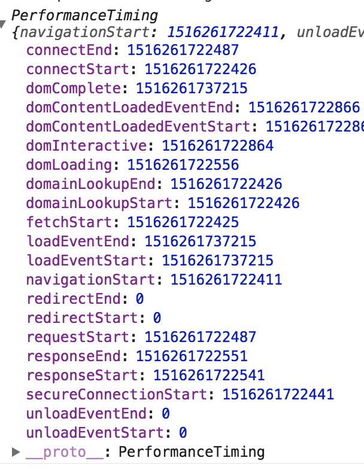

# 性能

## Performance API

```js
/*
navigationStart: 页面 unload 事件触发
| 浏览器内核加载新页面
fetchStart：表示开始获取当前页面的内容
| 查询缓存（如果有，直接从缓存获取）
dmainLookupStart
| DNS 解析
domainLookupEnd
connectStart
| TCP 连接
connectEnd
requestStart
| 请求内容至服务器
| 浏览器接收完整的响应结果
[requestEnd] 
| --- 同时 ---
[domLoading]
| 开始 DOM 树解析
domInteractive
domContentLoadedStart
| 运行脚本，加载依赖外部资源
domContentLoadedEnd
domComplete
| 触发 window.onload 
loadEventStart
| 执行 load 回调
loadEventEnd
*/
window.performance.timing
```

