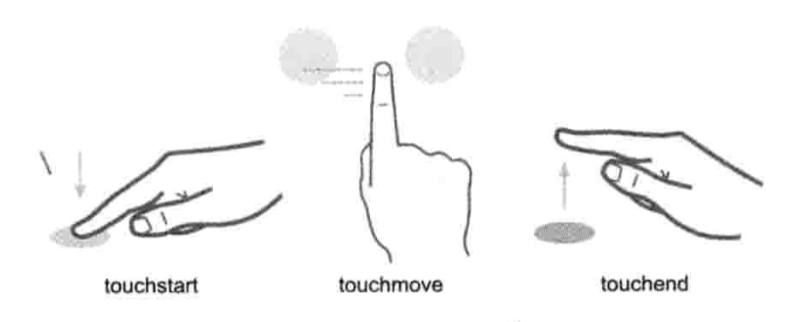

# 触摸 & 手势



## [基础原理](./Basic.md#touch)

### leen-helper
个人封装的 ES6 移动端手势库

[github](https://github.com/LeenJQ/leen-toucher)

## 常见问题

### 替换click 300ms 延迟

> 移动端click 为了判断是单击还是其他操作，延迟了click 300ms，可以使用如下方案加快响应

#### 使用 fastclick 库
https://github.com/ftlabs/fastclick

> fastclick 既可以绑定在全局body，也可以绑定在指定的 DOM click事件上

#### 原生简单实现

```javascript
document.addEventListener('touchstart',function (event) {  
  if(event.touches.length>1){  
      event.preventDefault();  
  }  
})  
var lastTouchEnd=0;  
document.addEventListener('touchend',function (event) {  
  var now=(new Date()).getTime();  
  if(now-lastTouchEnd<=300){  
      event.preventDefault();  
  }  
  lastTouchEnd=now;  
},false)  
```

## 库
 * [toucher](https://github.com/bh-lay/toucher/blob/master/asset/toucher.js)
 * [fastclick](https://github.com/ftlabs/fastclick)